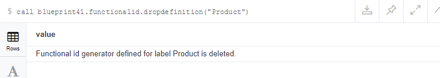

# blueprint41 functionalId

Blueprint41 contains blueprint41 neo4j procedures

## Functional ID generator

Functional Id's can be generated via a procedure on Neo4j (version 3+). The database is used to persist the Functional Id state. 

### Create Functional ID generator

```
blueprint41.functionalid.create( String label, String prefix, long startFrom)
returns the FunctionalId state.
```
|parameter|description|
|:--------|:----------|
|Label|The entity where you want to create the functional id's for|
|Prefix|The prefix which will be used in the functional id|
|startFrom|A number is used to generate a 6 character hash, this makes it possible to start from a higher number without interfering with existing id's generated in a project.

Example:


### Create one new functional ID

```
blueprint41.functionalid.next(String label) returns a value
```

Label	The entity where you want to create the new functional id for

Example:


### Generate a batch of new ID's

This is handy when you want to do bulk loads. Note that a functional id is only generated once.

```
blueprint41.functionalid.nextBatch(String label, long batchSize)
returns a value
```
|parameter|description|
|:--------|:----------|
|Label|The entity where you want to create the new functional id for|
|batchSize|	The amount of functional id's which must be generated

Example:


### Current state 

Show the current state of an functional Id generator.
```
blueprint41.functionalid.current(String label)
```

Example:


 
### List all functional id generators

```
blueprint41.functionalid.list()
returns a list with all the functional id states.
```
Example:


 

### Drop functional id generator
HANDLE with care!!

```
blueprint41.functionalid.dropdefinition(String Label)
```

Example:

 
